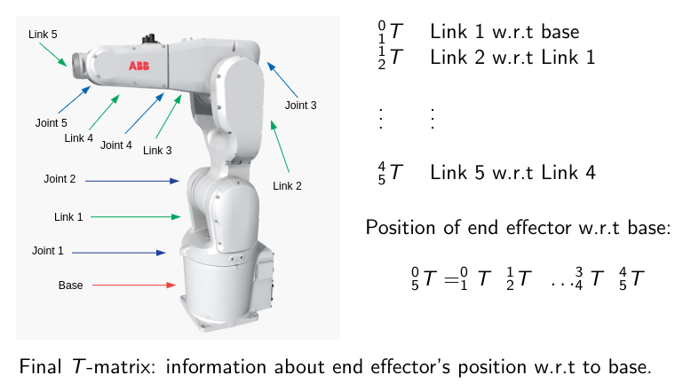
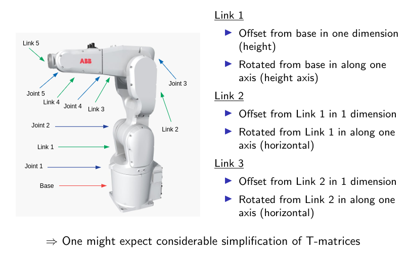
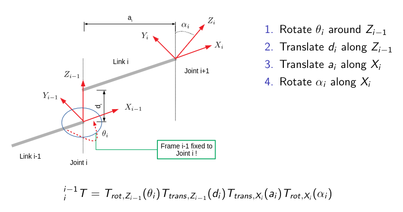
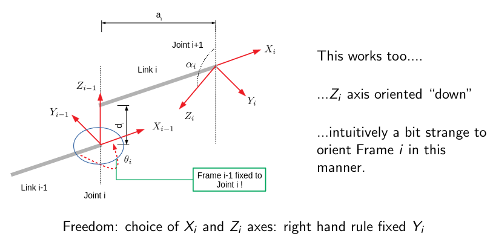

Forward kinematics (FK) allow us to determine the position of the end-effector based on the positions of the joints of the robot.

## Recommended Pre-Reading

Before reading this, you should have some familiarity with matrices and algebra, and you should read the discuss on [transformations]().

---

A robot is modelled as a series of links and joints.

{}
Joint $i$ separates links $i-1$ and $i$
{}

The base coordinate system is frame $0$, and the end-effector is frame $n$. It is natural to express the motion of link $i$ w.r.t. link $i-1$.

FK express motion of an end-effector by carrying out a sequence of transformations starting at the base frame and progressing through links until reaching the end-effector.



$$
^0_nT=~^0_1T~^1_2T\dots~^{n-2}_{n-1}T~^{n-1}_nT
$$



Where $^{i-1}_iT$ is a homogeneous transformation matrix.

Expressing FK using a kinematic chain makes sense because it is relatively easy to express the motion of one joint w.r.t. another. It is considerably more difficult to directly express the end-effector position w.r.t. the base without the use of a kinematic chain.

## Observations on Robot Structure

The structure of a homogeneous transformation matrix is complicated and dependent on the origins of the consitituent reference frames, therefore it also depends on the structure of the robot.

It is possible to reduce these concerns by observing that for most robots:

- Most links are not rotated in 3D from the previous one
- Most links are not offset from another in 3D

## Denavit-Hartenberg Method

A the Denavit-Hartenberg (DH) method is a semi-systematic method for obtaining the FK equations for robots. It guides the choosing of appropriate frames and effectively determines the T-matrix for each link.

It incorporates the simplifications outlined above which is useful as it is effectively universally applicable and gives a common framework for kinematic equations.

{}
The DH method assumes each joint is either revolute or prismatic. The joint variable for revolute joints is the angle, $\theta$. For prismatic joints, the joint variable is the linear actuator distance, $d$.
{}

Reference frames are established by following these rules:

1. Each $Z$ axis passes through a joint
2. The $X_i$ axis is perpendicular to the $Z_{i-1}$ axis
3. The $X_i$ axis intersects the $Z_{i-1}$ axis
4. The $Y_i$ axis is determined by the choice of $X_i$ and $Z_i$ (RH system)

### Homogeneous Transformations

Once the reference frames are established, the DH method gives a systematic method for deriving the T-matrices for each link

The protocol for moving reference frames in the DH convention is:

1. Rotate $\theta$ around $Z_{i-1}$
2. Translate $d$ along $Z_{i-1}$
3. Translate $a$ along $X_i$
4. Rotate $\alpha$ along $X_i$



$$
^{i-1}_iT=~T_{\text{rot},Z_i-1}~~T_{\text{trans},Z_i-1}~~T_{\text{trans},X_i}~~T_{\text{rot},X_i}
$$



For each joint only one joint parameter is assumed ($\theta$ or $d$).

### Axis Notation

The DH method places the $i-1$th frame on the $i$th joint.

### Frame Uniqueness

The DH method does not choose frames uniquely; $X_i\perp Z_{i-1}$ and they must intersect.

We can choose the “up” or “down” nature of $Z_i$ and the “forward” or “backwards” nature of $X_i$; but we should choose the most intuitive orientation. If $Z_i$ and $Z_{i-1}$ axes are coincident, then the $X_i$ direction is completely free; choose the simplest choices to zero some entries in the T-matrix. If $Z_i$ and $Z_{i-1}$ are parallel, $O_i$ is arbitrary; choose the simplest choice to zero some entries in the T-matrix.

### Method Summary

1. Assume a robot has $n$ joints and $n+1$ links
2. Joint $i$ connects link $i-1$ and $i$
3. The $i-1$th reference frame $\mathcal{F}_{i-1}$ is located on the joint $i$
4. The $Z_{i-1}$ axis passes through joint $i$
5. Each joint is either prismatic ($d_i$ variable) or revolute ($\theta_i$ variable)
6. The base frame is assigned first: this is essentially arbitrary
7. Each reference frame is determined sequentially such that $X_i\perp Z_{i-1}$
8. Determine the 4 DH parameters
   1. $\theta_i$: joint angle between link $i-1$ and link $i$ (the angle around $Z_{i-1})$
   2. $d_i$: link offset is the distance alone $Z_{i-1}$ until the intersection with $X_i$
   3. $a_i$: link length is the distance along $X_i$$Z_{i-1}$ and $Z_i$
   4. $\alpha_i$: twist offset is the angle between $Z_{i-1}-X_{i-1}$ planes and the $Z_i-X_i$ planes
