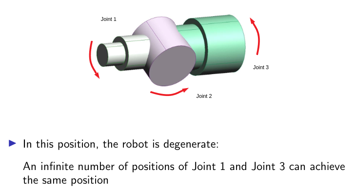
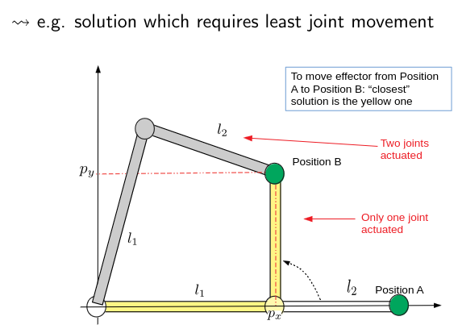
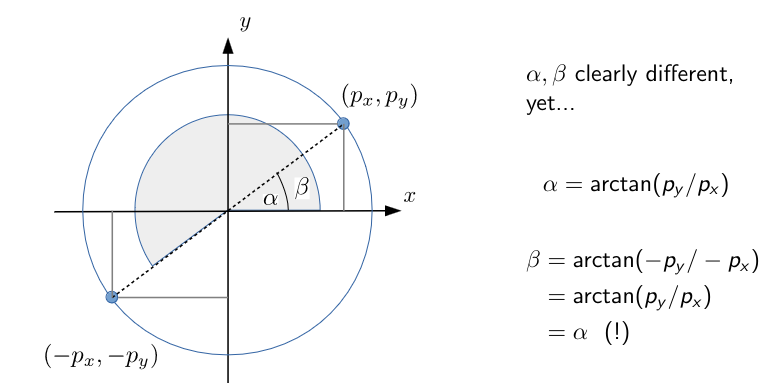

Inverse kinematics (IK) allow us to determine the required joint angles of a robot given the desired position of the end-effector.

## Recommended Pre-Reading

Before reading this, you should familiarise yourself with [Forward Kinematics]().

---

Inverse kinematics (IK) is a hard problem, a solution may not exist or may not be unique. This is because the IK problem is nonlinear and there are no general methods of solving nonlinear equations.

One reason for a potential lack of solutions is algebraic; this is essentially a lack of degrees of freedom (DoF). A solution to the IK problem requires enough DoF. Issues can also arise relating to the workspace of the robot. If the specified pose of the end-effector is outside of the workspace, no solution can exist.

{}
Generally, arbitrary positioning and orientation of an end-effector in 3D space requires 6 DoF
{}

Typically kinematic equations are nonlinear. There are no general methods of solving nonlinear equations, and thus, even if a solution exists it may not be unique. In addition, if a robot is kinematically redundant, there will always be multiple solutions to their IK equations.

## Degeneracy

Degeneracy is an extreme case of redundancy where a robot has an infinite number of IK solutions.

## Resolving Multiple Solutions

While redundancy in manipulators may be advantageous in some respects, for a real robot this needs addressing. How do we get the computer to choose the “right” solution?

There are two main approaches to this:

- Constraints
  - Hardware constraints on joints often exist; these effectively eliminate some solutions
    - e.g. constraining manipulator angle $\tilde{\theta}_2\in[0,\pi]$ eliminates $(\tilde{\theta_1},\tilde{\theta_2})$ solutions
  - Software constraints to guide the solutions

But robots are rarely static, and IK is used to move a robot from position A to position B. If the kinematics equation of position B has multiple solutions, pick the one closest to position A.

## $\arctan$

Many analytical IK equations feature the $\arctan(\cdot)$ function; the range of $\arctan$ is $(-\frac{\pi}{2},\frac{\pi}{2})$ and thus often not satisfactory.

Replace $\arctan(\cdot)$ with the double argument $\text{atan2}(\cdot,\cdot)$. This prevents the symmetry and infinity issues with $\arctan$.

{}
From now on, interpret $\arctan$ as $\text{atan2}$.
{}



$$
\text{atan2}(y, x) =
\begin{cases}
\arctan\left(\frac{y}{x}\right) & x > 0 \\
\arctan\left(\frac{y}{x}\right) + \pi & x < 0, y \geq 0 \\
\arctan\left(\frac{y}{x}\right) - \pi & x < 0, y < 0 \\
\frac{\pi}{2} & x = 0, y > 0 \\
-\frac{\pi}{2} & x = 0, y < 0
\end{cases}
$$



## From FK to IK

There is an alternative way to represent FK. The symbolic way would be:



$$
\begin{bmatrix}p_x\\p_y\\p_z\\\phi\\\theta\\\psi\end{bmatrix}=f\begin{pmatrix}\begin{bmatrix}q_1\\q_2\\\vdots\\q_n\end{bmatrix}\end{pmatrix}\qquad f(.):\mathbb{R}^n\mapsto\mathbb{R}^6
$$



The process of solving IK is therefore reversing this relationship.



$$
\begin{bmatrix}q_1\\q_2\\\vdots\\q_n\end{bmatrix}=f^{-1}\begin{pmatrix}\begin{bmatrix}p_x\\p_y\\p_z\\\phi\\\theta\\\psi\end{bmatrix}\end{pmatrix}\qquad f^{-1}(.):\mathbb{R}^6\mapsto\mathbb{R}^n
$$



IK is finding $f^{-1}$ (if it exists).

## IK Assumptions

We will assume that a solution exists, and therefore we must assume:

- The end-effector motion is feasible (inside the workspace)
- There are enough DoF present

## Categories of IK Solutions

There are two main categories of IK solutions:

- **Analytical methods** provide symbolic solutions to the IK problem. Typically such solutions are valid for all (or almost all) values of the end-effector motion.
- **Numerical methods** provide particular solutions for certain values.

### Analytical Solutions

Analytical solutions are derived using mathematical techniques to find exact solutions to the IK problem. There are two main categories of analytical solutions.

#### Algebraic

One states a desired form of T-matrix and then equates this to the FK expression.



$$
T_{\text{des}}=~^n_0T(q_1,q_2,\dots,q_n)
$$



This gives a set of equations (ostensibly 12, but normally fewer) which need solving for the unknowns $q_1,\dots,q_n$.

1. Specify the desired T-matrix for the end-effector
2. Equate this to the T-matrix resulting from the FK equations



$$
T_\text{des}=\begin{bmatrix}
\tilde{r_{11}}&\tilde{r_{12}}&\tilde{r_{13}}&\tilde{p_{x}}\\\tilde{r_{21}}&\tilde{r_{22}}&\tilde{r_{23}}&\tilde{p_{y}}\\\tilde{r_{31}}&\tilde{r_{32}}&\tilde{r_{33}}&\tilde{p_{z}}\\0&0&0&1
\end{bmatrix}=\begin{bmatrix}
r_{11}(q)&r_{12}(q)&r_{13}(q)&p_{x}(q)\\r_{21}(q)&r_{22}(q)&r_{23}(q)&p_{y}(q)\\r_{31}(q)&r_{32}(q)&r_{33}(q)&p_{z}(q)\\0&0&0&1
\end{bmatrix}=~^0_nT
$$



This gives 12 equations in the unknown parameters in the vector $q=[q_1\dots q_n]'$:



$$
\begin{align*}\tilde{r_{11}}&=r_{11}(q)\\\tilde{r_{12}}&=r_{12}(q)\\\vdots~~&=~~\vdots\end{align*}
$$



The equation matrix is often reduced: DH representation; R-matrix orthogonal

### Geometric

One can also decompose the IK problem into a set of planar geometry problems which are typically easy to solve but sometimes require some creativity.

1. Decompose the IK problem into a number of planar geometry problems
2. Solve these using basic geometry

This approach is straightforward but often quite intricate.

### Numerical Methods

There are also subcategories of numerical methods for solving IK problems.

{}
We will not go into detail about these methods.
{}

#### Iterative

Normally involves expanding $f(.)$ with a Taylor series and refining the initial solution. Various algorithms of this type are implemented in `Matlab`.

#### “Intelligent” methods

Various techniques such as NNs, fuzzy logic, and particle swarm optimisation (PSO) can be harnessed to solve the IK problem. This can be quick but unreliable.
