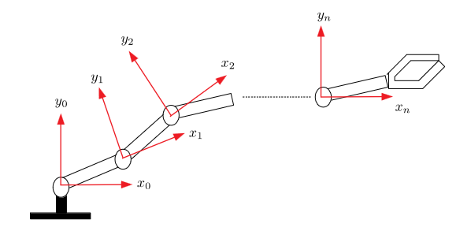
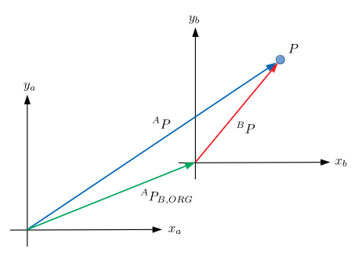
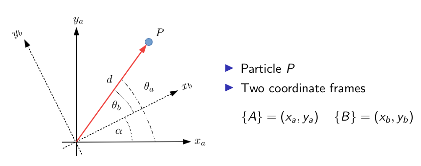
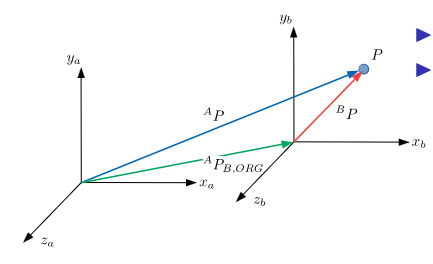
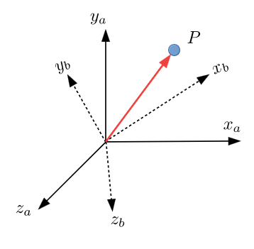

This guide will provide a brief overview on how reference frames transform as we move through a kinematic chain. These concepts are necessary before moving on to more advanced kinematics guides.

{}
For reasons you will see later, this guide will focus on manipulator robots, but the ideas are transferrable to other morphologies.
{}

## Recommended Pre-Reading

Before reading this, you should have some familiarity with matrices and algebra.

---

## Kinematic Chains

Robot manipulators (arms) can be thought of chains of reference frames, or kinematic chains. The transformation for a reference frame is entirely dependent on the previous frame.

It is easy to determine the $i$th joint position w.r.t. the $i-1$th reference frame, therefore the end-effector position is determined by traversing the chain:


$$ {}^0_nT={}^0_1T\,{}^1_2T\,\cdots\,{}^{n-1}\_nT $$


Where $^{i-1}_iT$ is the transformation matrix from link $i-1$ to link $i$. In other words the rotation and displacement of frame $i$ w.r.t. frame $i-1$

## 2D Transformations

To begin, we will look at only two dimensions. Once we have gone over the basics, we can extend to the three dimensions of the real world.

### Translation

Consider the below image.

There exists some particle $P$ with two coordinate frames $\{A\}=(x_a, y_a)$ and $\{B\}=(x_b,y_b)$. $^AP_{B,\text{ORIG}}$ is the origin of $\{B\}$ w.r.t. $\{A\}$. The position of the particle in frame $Q$ is defined as $^QP$.

If we know the position of the particle in frame $B$, we can find the position of $P$ in frame $A$, $^AP=~^AP_{B,\text{ORIG}}+~^BP$, where $^AP_{B,\text{ORIG}}$ is a translational mapping from $\{A\}$ to $\{B\}$.

### Rotation

We can use a similar approach for calculating the rotation between two reference frames.

Firstly, we must define our two frames,$\{A\}$ and $\{B\}$. The position vector w.r.t. $\{A\}$ is $^AP=d\begin{bmatrix}\cos\theta_a \\ \sin\theta_a\end{bmatrix}$; and for $\{B\}$, $^BP=d\begin{bmatrix}\cos\theta_b \\ \sin\theta_b\end{bmatrix}$.

{}
It is worth noting that $\theta_a=\alpha+\theta_b$$.
{}

We can use this information to find an equation to rotate the position vector between frames.



$$
\begin{align*}
  ^AP&=d\begin{bmatrix}\cos(\theta_b+\alpha)\\\sin(\theta_b+\alpha)\end{bmatrix}\\&=d\begin{bmatrix}
  \cos\theta_b\cos\alpha-\sin\theta_b\sin\alpha\\
  \sin\theta_b\cos\alpha+\cos\theta_b\sin\alpha
  \end{bmatrix}\\&=
  \begin{bmatrix}
  \cos\alpha & -\sin\alpha\\\sin\alpha&\cos\alpha
  \end{bmatrix}d\begin{bmatrix}\cos\theta_b\\\sin\theta_b\end{bmatrix}\\
  &=
  \begin{bmatrix}
  \cos\alpha & -\sin\alpha\\\sin\alpha&\cos\alpha
  \end{bmatrix}~^BP
\end{align*}
$$



The matrix $^A_BR=\begin{bmatrix}\cos\alpha&-\sin\alpha\\\sin\alpha&\cos\alpha\end{bmatrix}$ is a rotation matrix for the rotation of the axes of $\{B\}$ by $\alpha$ (anti-clockwise) from $\{A\}$

Succinctly, we can write this as $^AP=~^A_BR~^BP$$.

### Homogeneous Transformations

We can combine translations and rotations into a single operation called a homogeneous transformation.

If a coordinate frame $\{B\}$ is translated by the vector $^AP_{B,\text{ORIG}}$ from $\{A\}$ and also rotated by an angle $\alpha$ anti-clockwise, if we know the position of a particle in $\{B\}$ we can express it in $\{A\}$



$$
^AP=~^AP_{B,\text{ORIG}}+~^A_BR~~^BP
$$



This can be expressed in matrix form as



$$
^AP=\begin{bmatrix}^A_BR&^AP_{B,\text{ORIG}}\end{bmatrix}\begin{bmatrix}^BP\\1\end{bmatrix}
$$



This above matrix is not square and so not invertible, so we can augment it as



$$
\begin{bmatrix}^AP\\1\end{bmatrix}=\begin{bmatrix}^A_BR&^AP_{B,\text{ORIG}}\\0&1\end{bmatrix}\begin{bmatrix}^BP\\1\end{bmatrix}
$$



By defining $^A\tilde{P}:=\begin{bmatrix}^AP\\ 1\end{bmatrix}$ and $^B\tilde{P}:=\begin{bmatrix}^BP\\ 1\end{bmatrix}$ we have $^A\tilde{P}=~^A_BT~~^B\tilde{P}$ where $^A_BT=\begin{bmatrix}^A_BR&^AP_{B,\text{ORIG}}\\0&1\end{bmatrix}$

{}
**Homogeneous Transformation:** the matrix $^A_BT$ is the so-called homogeneous transformation matrix which expresses the transformation between the frame $\{B\}$ and $\{A\}$.
{}

The matrices of ${}^A_BT$ can be expanded to produce the matrix



$$
{}^A_BT=\left[ \begin{array}{c c|c}
\cos \alpha & -\sin \alpha & ({}^A P_{B,\text{ORIG}})_x \\
\sin \alpha & \cos \alpha & ({}^A P_{B,\text{ORIG}})_y \\
\hline
0 & 0 & 1 \\
\end{array} \right]
$$



## 3D Transformations

The method for 3D transformations is similar to that in 2D, just with an extra dimension!

### Translation

Consider the below image.

For some particle $P$ there are two coordinate frames:



$$
\begin{align*}
\{A\}&=(x_a,y_a,z_a)\\
\{B\}&=(x_b, y_b, z_b)
\end{align*}
$$



Similarly, $^AP_{B,\text{ORIG}}$ is the origin of $\{B\}$ w.r.t. $\{A\}$.

We can use this to map between frames, $^AP=~^AP_{B,\text{ORIG}}+~^BP$. Therefore, $^AP_{B,\text{ORIG}}$ is a translational mapping from $\{B\}$ to $\{A\}$, and $^AP$ and $^BP$ are the positions of the particle in the respective frames.

### Rotation

Rotations are fundamentally more difficult in 3D than in 2D.

- There are three axes which can be rotated around
- These axes can either be fixed (static) or move with each rotation (non-static)
- The order of rotation, while philosophically unimportant, is of vital importance for consistency
- The rotation matrix formed by rotation in a particular order is not the same as the rotation matrix for a different order

Expressing $\{B\}$ w.r.t. $\{A\}$ requires rotation around three axes in general. The order of rotation is important, there is not a single unique mapping between the two frames.

#### Intrinsic vs. Extrinsic Rotation

{}
This is also referred to as non-static/relative vs. static rotation.
{}

For **intrinsic/relative rotation**, rotation is done around intermediate reference frames, and the rotation matrices are post-multiplied; this means that the first rotation matrix in the expression is the first rotation in the sequence.

For **extrinsic/static rotation**, all rotation is done around a fixed reference frame, and rotation matrices are pre-multiplied; this means the first rotation matrix in the expression is the last rotation in the sequence.

#### Extrinsic Rotation

A common way to rotate in 3D is the “fixed X-Y-Z” way:

1. Rotate about the X-axis (fixed)
2. Rotate about the Y-axis (fixed)
3. Rotate about the Z-axis (fixed)

This yields the rotation matrix $^A_BR_{XYZ}(\alpha, \beta,\gamma)=R_Z(\alpha)R_Y(\beta)R_X(\gamma)$

The individual rotation matrices are



$$
\begin{aligned}
    R_Z(\alpha) &=
    \begin{bmatrix}
        \cos\alpha & -\sin\alpha & 0 \\
        \sin\alpha & \cos\alpha & 0 \\
        0 & 0 & 1
    \end{bmatrix}\\
    R_Y(\beta) &=
    \begin{bmatrix}
        \cos\beta & 0 & \sin\beta \\
        0 & 1 & 0 \\
        -\sin\beta & 0 & \cos\beta
    \end{bmatrix}\\
    R_X(\gamma) &=
    \begin{bmatrix}
        1 & 0 & 0 \\
        0 & \cos\gamma & -\sin\gamma \\
        0 & \sin\gamma & \cos\gamma
    \end{bmatrix}
\end{aligned}
$$



When combined together, it looks something like this

The combined rotation matrix is



$$
{}^A_B R_{XYZ}(\alpha, \beta, \gamma) =
\begin{bmatrix}
    \cos\alpha \cos\beta & \cos\alpha \sin\beta \sin\gamma - \sin\alpha \cos\gamma & \cos\alpha \sin\beta \cos\gamma + \sin\alpha \sin\gamma \\
    \sin\alpha \cos\beta & \sin\alpha \sin\beta \sin\gamma + \cos\alpha \cos\gamma & \sin\alpha \sin\beta \cos\gamma - \cos\alpha \sin\gamma \\
    -\sin\beta & \cos\beta \sin\gamma & \cos\beta \cos\gamma
\end{bmatrix}
$$



#### Intrinsic Rotation

The general idea is to rotate successively into intermediate (relative) reference frames

1. Perform one rotation
2. This rotation establishes a new frame
3. Perform another rotation
4. This rotation establishes a new frame
5. Perform a final rotation

This can be denoted $^A_BR=~^A_{B'}R~^{B'}_{B^{\prime\prime}}R~^{B^{\prime\prime}}_BR$$

As before, the rotation matrix comprises of a product of rotation matrices and must be carried out in a specific order.

{}
There are various different conventions, we will use $Z$-$Y$-$X$ Euler Angles.
{}

Noting that we rotate about the intermediate axes $Y'$ and $X''$



$$
^A_BR_{ZY'X''}(\psi, \theta,\phi)=R_Z(\psi)R_{Y'}(\theta)R_{X''}(\phi)
$$



Where our rotation matrices are



$$
\begin{aligned}
  R_Z(\psi) &=
  \begin{bmatrix}
    \cos \psi & -\sin \psi & 0 \\
    \sin \psi & \cos \psi & 0 \\
    0 & 0 & 1
  \end{bmatrix}\\
  R_Y(\theta) &=
  \begin{bmatrix}
    \cos \theta & 0 & \sin \theta \\
    0 & 1 & 0 \\
    -\sin \theta & 0 & \cos \theta
  \end{bmatrix}\\
  R_{X''}(\phi) &=
  \begin{bmatrix}
    1 & 0 & 0 \\
    0 & \cos \phi & -\sin \phi \\
    0 & \sin \phi & \cos \phi
  \end{bmatrix}
\end{aligned}
$$



The rotation matrices have the same form as in fixed axis rotation but the axes about which the rotation takes place are different.

This gives an overall rotation matrix of



$$
R_{Z'X''Y''}(\psi, \theta, \phi) = \begin{bmatrix}
\cos\psi\cos\theta & \cos\psi\sin\theta\sin\phi - \sin\psi\cos\phi & \cos\psi\sin\theta\cos\phi + \sin\psi\sin\phi \\
\sin\psi\cos\theta & \sin\psi\sin\theta\sin\phi + \cos\psi\cos\phi & \sin\psi\sin\theta\cos\phi - \cos\psi\sin\phi \\
-\sin\theta & \cos\theta\sin\phi & \cos\theta\cos\phi
\end{bmatrix}
$$



### Homogeneous Transformations

Similar to in 2D, homogeneous transformations provide a way of combining rotations and translations

As with 2D, given a position w.r.t. frame $\{B\}$ the position w.r.t. frame $\{A\}$ can be obtained via



$$
^AP=~^AP_{B,\text{ORIG}}+~^A_BR~~^BP
$$



Where $^AP_{B,\text{ORIG}}$ is a vector describing a translation of the origin of frame $\{B\}$ in $\{A\}$ coordinates. $^A_BR$ is a rotation matrix describing a rotation of the $\{B\}$ axes w.r.t. frame $\{A\}$

Homogeneous transformations in 3D are given by



$$
\begin{align*}
  ^AP&=\begin{bmatrix}^A_BR&^AP_{B,\text{ORIG}}\end{bmatrix}\begin{bmatrix}^BP\\1\end{bmatrix}\\
  \implies \begin{bmatrix}^AP\\1\end{bmatrix}&=\begin{bmatrix}^A_BR&^AP_{B,\text{ORIG}}\\0&1\end{bmatrix}\begin{bmatrix}^BP\\1\end{bmatrix}\\
  \implies ^A\tilde{P}&=~^A_BT~~^B\tilde{P}
\end{align*}
$$



Where



$$
^A_BT=\begin{bmatrix}^A_BR&^AP_{B,\text{ORIG}}\\0&1\end{bmatrix}
$$



This can be expanded to



$$
{}^A_BT =
\begin{bmatrix}
    \cos\alpha \cos\beta & \cos\alpha \sin\beta \sin\gamma - \sin\alpha \cos\gamma & \cos\alpha \sin\beta \cos\gamma + \sin\alpha \sin\gamma  & {}^BP_x\\
    \sin\alpha \cos\beta & \sin\alpha \sin\beta \sin\gamma + \cos\alpha \cos\gamma & \sin\alpha \sin\beta \cos\gamma - \cos\alpha \sin\gamma & {}^BP_y\\
    -\sin\beta & \cos\beta \sin\gamma & \cos\beta \cos\gamma & {}^BP_z \\
    0 & 0 & 0 & 1
\end{bmatrix}
$$



Items to note about 3D homogeneous transformation matrices:

- 4x4 matrix describing rotation/translation
- 9 entries describing rotation; 3 describing translation
- The basis of most kinematics equations

Similar to 2D, we find that $^A_BT=~^A_CT~~^C_BT$$. This transfers directly to our robotics applications in that $^0_nT=^0_1T\dots~^{n-1}\_nT$ (c.f. kinematics chain image at the start of this page).
